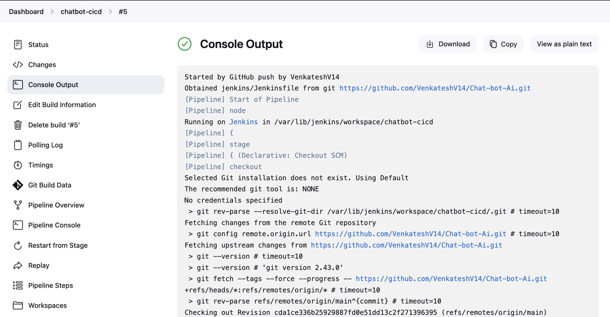
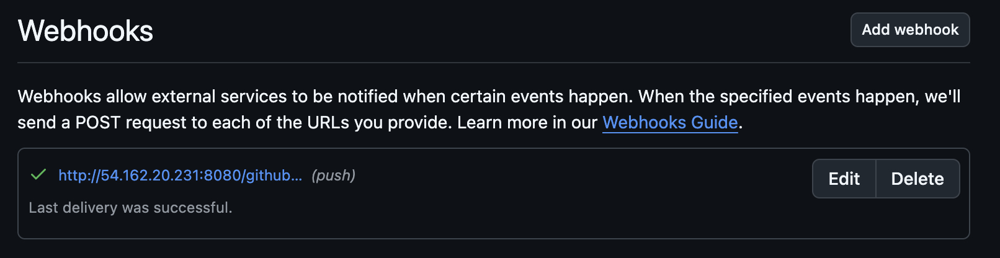
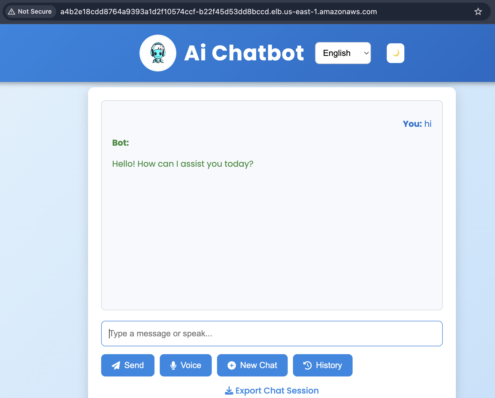

# Scalable AI Chatbot Deployment with End-to-End DevOps Automation

This project demonstrates a complete CI/CD pipeline for deploying a Django-based AI chatbot application on AWS EKS using modern DevOps tools like Terraform, Jenkins, Docker, Kubernetes, and Ansible.

---

## 🚀 Project Overview

- **Frontend**: HTML, CSS, JS chatbot interface  
- **Backend**: Django REST API  
- **ML Model**: Integrated via Python in the backend  
- **CI/CD**: Jenkins with GitHub Webhooks for automation  
- **Infrastructure**: Provisioned using Terraform  
- **Containerization**: Docker  
- **Orchestration**: Kubernetes on AWS EKS  
- **Config Management**: Ansible  

---

## 📌 Features

- Push-to-deploy setup via GitHub Webhooks  
- Fully automated EKS infrastructure provisioning with Terraform  
- Dockerized backend/frontend with Jenkins-driven pipelines  
- Rolling deployments using Kubernetes  
- Secrets & image management best practices  
- Clean, professional UI chatbot  

---

## 📁 Project Structure
```
├── chatbot/                
├── chatbot_project
├── jenkins/                
├── terraform/              
├── ansible/               
├── kuberntes/               
├── Dockerfile              
├── .gitignore              
├── requirements.txt
├── images
└── README.md               
```

---

## 🔧 Setup Instructions

### Prerequisites

- AWS CLI configured (`aws configure`)  
- Docker, `kubectl`, `eksctl` installed  
- Jenkins setup with necessary credentials  
- GitHub repository & Webhooks configured  

### 1. Provision Infrastructure

```bash
cd terraform/
terraform init
terraform plan
terraform apply
```
### 2. Configure Jenkins
- Add DockerHub and AWS credentials
- Set up pipeline using jenkins/Jenkinsfile 
- Ensure Webhook triggers on push

### 3. Trigger Deployment
- Push code changes to GitHub → Webhook triggers Jenkins
- Jenkins builds & pushes Docker image
- Kubernetes is updated with the latest image
- Chatbot is live on the EKS LoadBalancer

## 🖼️ Highlights








## 📌 Key Takeaways:
- End-to-end DevOps flow: from infrastructure to deployment
- Real-time updates with GitHub Webhooks
- Production-grade setup using AWS best practices
- Clean architecture for scalability and maintainability

## 🤝 Author
- **Venkatesh V**
- DevOps Engineer | Cloud Enthusiast
- [LinkedIn](https://www.linkedin.com/in/venky-venkatesh) • [Hashnode Blog](https://devops-automation.hashnode.dev/building-an-end-to-end-devops-pipeline-on-aws-with-jenkins-docker-kubernetes-terraform-and-ansible) • [Portfolio](https://www.venky-devops-engineer-vde.xyz/) • [Live Resume](https://www.ganeshinfo.life/)